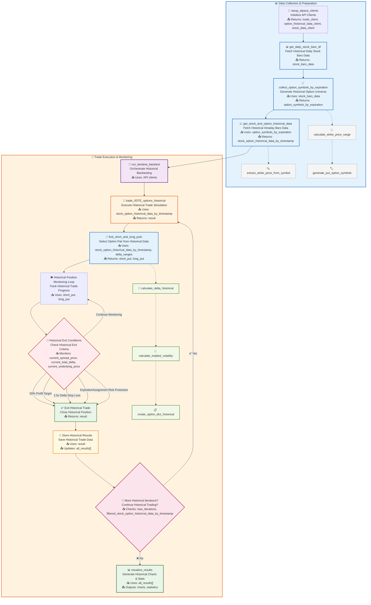

# 0DTE Options Strategy Backtesting System

## Overview
This system lets you backtest a 0DTE (zero days to expiration) bull put spread options strategy using historical data from Alpaca and Databento. It automates the process of finding, simulating, and evaluating same-day expiry put spreads on underlying stock (default: SPY), with robust risk management and predefined trade logic.

**Note:** This backtesting system is supplemental to our tutorial guide [How To Trade 0DTE Options with Alpaca's Trading API](https://alpaca.markets/learn/how-to-trade-0dte-options-on-alpaca), which covers the theoretical foundations and practical implementation of 0DTE strategies using the live market data.


## How It Works (Summary)
1. **Setup**: Connect to Alpaca and Databento API and set parameters.
2. **Data Collection**: Download historical stock (bar data) and options data (tick data) at 1-minute intervals for the backtesting window.
3. **Trade Simulation**:
   - **Initialization**: 
     - Start scanning through historical market data chronologically from the earliest timestamp.
   - **Option Analysis**:
     - Calculate the options Greeks (delta) and Implied Volatility (IV) for each option symbol.
     - Find the first valid option pair that meets our trading criteria to build the bull put spread
   - **Continuous Monitoring**:
     - Perform these calculations every minute to identify suitable option legs.
   - **Spread Formation**:
     - Once suitable option legs are identified at the same timestamp, calculate the credits to be received and the total delta.
   - **Trade Management**:
     - Simulate entering the bull put spread.
     - Monitor for exit conditions such as profit targets, stop-loss triggers, or expiration.
4. **Results**: Aggregate and visualize the results for performance analysis.

## Data Sources

Dual API Integration for Comprehensive Market Data:
- **Alpaca Trading API**: Stock daily bars + 1-minute intraday data
- **Databento API**: Options 1-minute tick data with bid/ask spreads

This combination provides both the underlying stock context and detailed options pricing needed for accurate 0DTE backtesting, leveraging each platform's strengths.

## Installation
### 1. Prerequisites
- Alpaca Trading API account
  - `ALPACA_API_KEY` and `ALPACA_SECRET_KEY` from your [Alpaca dashboard](https://app.alpaca.markets/dashboard/overview)
  - Check out our tutorial article: [How to Start Paper Trading with Alpaca's Trading API](https://alpaca.markets/learn/start-paper-trading?ref=alpaca.markets)
- Databento API account (https://databento.com/signup)
  - `DATABENTO_API_KEY` from your [Databento dashboard](https://databento.com/portal/keys)
- Google Colab or Code Editor (IDE)
- Python
- Python package manager (e.g pip or uv)

### 2. Environment Configuration

The notebook has a code block that automatically detects whether it's running in Google Colab or a local code editor.

  ```python
  if 'google.colab' in sys.modules:
      # In Google Colab environment, we will fetch API keys from Secrets.
      # Please set ALPACA_API_KEY, ALPACA_SECRET_KEY, DATABENTO_API_KEY in Google Colab's Secrets from the left sidebar
      from google.colab import userdata
      ALPACA_API_KEY = userdata.get("ALPACA_API_KEY")
      ALPACA_SECRET_KEY = userdata.get("ALPACA_SECRET_KEY")
      DATABENTO_API_KEY = userdata.get("DATABENTO_API_KEY")
  else:
      # Please safely store your API keys and never commit them to the repository (use .gitignore)
      # Load environment variables from environment file (e.g., .env)
      load_dotenv()
      # API credentials for Alpaca's Trading API and Databento API
      ALPACA_API_KEY = os.environ.get('ALPACA_API_KEY')
      ALPACA_SECRET_KEY = os.environ.get('ALPACA_SECRET_KEY')
      DATABENTO_API_KEY = os.getenv("DATABENTO_API_KEY")
  ```

API keys are loaded differently based on the environment:
  - **Google Colab**: Uses [Colab's Secrets feature](https://x.com/GoogleColab/status/1719798406195867814) (set keys in the left sidebar) .
  - **Local IDE (e.g. VS Code, PyCharm)**: Uses environment variables from a `.env` file.
   


### 3. (For Local IDE Usage) Create and edit a .env file in your project directory to store environment variables
 1. Copy the example environment file in the project root by running this command:
    ```bash
    cp .env.example .env
    ```
 2. Insert your actual API keys in the `.env` file.
    ```bash
    # Edit .env with your API keys
    ALPACA_API_KEY=your_alpaca_api_key
    ALPACA_SECRET_KEY=your_alpaca_secret_key
    ALPACA_PAPER_TRADE=True
    DATABENTO_API_KEY=your_databento_api_key
    ```

### 3. (For Google Colab Usage) Use Colab's Secrets feature to store environment variables

For Colab usage, you do not need to use an environment file like `.env`.
  1. Open Google Colab, and go to Secrets.
  2. Enter the Name (e.g., ALPACA_API_KEY) and Value for each API key. While the Value can be changed, the Name cannot be modified.
  3. Toggle Notebook access.
  4. For using them in the notebook, use the given code with the name of your API keys.
      ```python
      from google.colab import userdata
      ALPACA_API_KEY = userdata.get("ALPACA_API_KEY")
      ALPACA_SECRET_KEY = userdata.get("ALPACA_SECRET_KEY")
      DATABENTO_API_KEY = userdata.get("DATABENTO_API_KEY")
      ```

### 4. Python Dependencies (Optional)

**Note:** If you're running the notebook in Google Colab, virtual environment setup is not necessary. 

If you need to install any dependencies, use the following commands:

**Option A: Using pip (traditional)**

```bash
python3 -m venv myvenv
source myvenv/bin/activate  # On Windows: myvenv\Scripts\activate
pip install databento alpaca-py python-dotenv pandas numpy scipy matplotlib jupyter ipykernel
```

**Option B: Using uv (modern, faster)**

To use uv, you'll first need to install it. See the [official uv installation guide](https://docs.astral.sh/uv/getting-started/installation/) for detailed installation instructions for your platform.
```bash
uv venv myvenv
source myvenv/bin/activate # On Windows: myvenv\Scripts\activate
uv pip install databento alpaca-py python-dotenv pandas numpy scipy matplotlib jupyter ipykernel
```

## Bull Put Spread Strategy Overview
A **bull put spread on 0DTE** is a credit spread strategy using options that expire the same trading day, which profits when the underlying asset stays above the short strike price at expiration.

**Structure:**
- **Sell** a higher-strike put (collect premium)
- **Buy** a lower-strike put (limit risk)
- **Net result**: Receive credit upfront

### Customizing Default Values
This section outlines the default values for the bull put spread strategy on 0DTE. These values are configurable and can be adjusted according to user preferences to better fit individual trading strategies and risk tolerance.

### Entry Criteria
- **Short Put Delta**: -0.60 to -0.20 (configurable)
- **Long Put Delta**: -0.40 to -0.20 (configurable)  
- **Spread Width**: $2-$4 (configurable)
- **Expiration**: Same day (0DTE)
- **Time Window**: 13:30-20:00 UTC (9:30-16:00 ET)

### Exit Conditions (Priority Order)
1. **Profit Target**: 50% of credit received (configurable)
2. **Delta Stop Loss**: 2.5x initial delta (configurable)
3. **Assignment Risk**: Underlying drops below short strike
4. **Expiration**: End of trading day

### Risk Management
- **Position Sizing**: Single contract spreads
- **Time Limits**: Intraday only
- **Delta Monitoring**: Continuous risk assessment
- **Automatic Stops**: No manual intervention


## Main Functions & Flow

- **setup_alpaca_clients**: Connects to Alpaca and returns API clients for trading, options, and stocks.
- **run_iterative_backtest**: Orchestrates the backtest, running multiple trades over the chosen period.
- **get_daily_stock_bars_df**: Fetches daily price bars for the underlying (e.g., SPY).
- **collect_option_symbols_by_expiration**: Collect option symbols grouped by expiration datetime based on stock bars data.
  - Uses **calculate_strike_price_range** and **generate_put_option_symbols** internally.
- **get_stock_and_option_historical_data**: Retrieves intraday bars for the underlying and tick data for options, organized by timestamp.
  - Uses **extract_strike_price_from_symbol** internally to extract strike price from option symbol.
- **trade_0DTE_options_historical**: Simulates a single bull put spread trade using historical data, monitoring for exit conditions.
- **find_short_and_long_puts**: Selects the best short and long put pair for the spread based on delta and spread width.
  - Uses **calculate_delta_historical** and **create_option_dict_historical** internally.
  - **calculate_delta_historical** uses **calculate_implied_volatility** to calculate both delta and IV.
- **visualize_results**: Plots cumulative P&L and basic stats for all trades.

## Workflow Diagram

