# 0DTE Bull Put Spread Backtesting System

## 🚀 Key Information
Most functions in this codebase are designed to work internally within the main `run_iterative_backtest` function. To backtest the 0DTE bull put spread strategy, you primarily need to execute the last two code chunks in the notebook: running `run_iterative_backtest` and visualizing the results. All other functions are helper functions that operate behind the scenes.

## Overview
This system lets you backtest a 0DTE (zero days to expiration) bull put spread options strategy using historical data from Alpaca and Databento. It automates the process of finding, simulating, and evaluating same-day expiry put spreads on underlying stock (default: SPY), with robust risk management and predefined trade logic.

## How It Works (Summary)
1. **Setup**: Connect to Alpaca and set parameters.
2. **Data Collection**: Download historical stock (bar data) and options data (tick data) at 1-minute intervals for the backtesting window.
3. **Trade Simulation**:
   - **Initialization**: 
     - Start scanning through historical market data chronologically from the earliest timestamp.
   - **Option Analysis**:
     - Calculate the options Greeks (delta) and Implied Volatility (IV) for each option symbol.
     - Find the first valid option pair that meets our trading criteria to build the bull put spread
   - **Continuous Monitoring**:
     - Perform these calculations every minute to identify suitable option legs.
   - **Spread Formation**:
     - Once suitable option legs are identified at the same timestamp, calculate the credits to be received and the total delta.
   - **Trade Management**:
     - Simulate entering the bull put spread.
     - Monitor for exit conditions such as profit targets, stop-loss triggers, or expiration.
4. **Results**: Aggregate and visualize the results for performance analysis.

## Workflow Diagram

```mermaid
flowchart TD
    %% Top section - Data Collection Workflow
    subgraph DataCollection ["📊 Data Collection & Preparation"]
        B["🔧 setup_alpaca_clients<br/>Initialize API Clients<br/>📤 Returns: trade_client, option_historical_data_client, stock_data_client"] --> D["📊 get_daily_stock_bars_df<br/>Fetch Historical Daily Stock Bars Data<br/>📤 Returns: stock_bars_data"]
        D --> E["🎯 collect_option_symbols_by_expiration<br/>Generate Historical Option Universe<br/>📥 Uses: stock_bars_data<br/>📤 Returns: option_symbols_by_expiration"]
        E --> F["📈 get_stock_and_option_historical_data<br/>Fetch Historical Intraday Bars Data<br/>📥 Uses: option_symbols_by_expiration<br/>📤 Returns: stock_option_historical_data_by_timestamp"]
        
        %% Internal functions for data collection
        E -.-> G1["📏 calculate_strike_price_range"]
        F -.-> I1["🔍 extract_strike_price_from_symbol"]
        G1 -.-> H1["🏷️ generate_put_option_symbols"]
    end
    
    %% Bottom section - Trade Execution Workflow
    subgraph TradeExecution ["💼 Trade Execution & Monitoring"]
        J["🔄 run_iterative_backtest<br/>Orchestrate Historical Backtesting<br/>📥 Uses: API clients"]
        K["💼 trade_0DTE_options_historical<br/>Execute Historical Trade Simulation<br/>📥 Uses: stock_option_historical_data_by_timestamp<br/>📤 Returns: result"] --> L["🎪 find_short_and_long_puts<br/>Select Option Pair from Historical Data<br/>📥 Uses: stock_option_historical_data_by_timestamp, delta_ranges<br/>📤 Returns: short_put, long_put"]
        L --> M["👁️ Historical Position Monitoring Loop<br/>Track Historical Trade Progress<br/>📥 Uses: short_put, long_put"]
        M --> N{"🚪 Historical Exit Conditions<br/>Check Historical Exit Criteria<br/>📥 Monitors: current_spread_price, current_total_delta, current_underlying_price"}
        N --> O["✅ Exit Historical Trade<br/>Close Historical Position<br/>📤 Returns: result"]
        O --> P["💾 Store Historical Results<br/>Save Historical Trade Data<br/>📥 Uses: result<br/>📤 Updates: all_results[]"]
        P --> Q{"🔁 More Historical Iterations?<br/>Continue Historical Trading?<br/>📥 Checks: max_iterations, filtered_stock_option_historical_data_by_timestamp"}
        
        %% Separate the Yes/No paths to avoid overlap
        Q -->|"✅ Yes"| K
        Q -->|"❌ No"| R["📊 visualize_results<br/>Generate Historical Charts & Stats<br/>📥 Uses: all_results[]<br/>📤 Outputs: charts, statistics"]
        
        %% Exit condition branches
        N -->|"50% Profit Target"| O
        N -->|"2.5x Delta Stop Loss"| O
        N -->|"Expiration"| O
        N -->|"Assignment Risk Protection"| O
        N -->|"Continue Monitoring"| M
        
        %% Internal functions for trade execution
        L -.-> S1["📐 calculate_delta_historical"]
        S1 -.-> T1["🌊 calculate_implied_volatility"]
        T1 -.-> U1["📋 create_option_dict_historical"]
    end
    
    %% Connection between the two main sections
    F --> J
    J --> K
    
    %% Styling
    style DataCollection fill:#e3f2fd,stroke:#1565c0,stroke-width:2px
    style TradeExecution fill:#fff3e0,stroke:#e65100,stroke-width:2px
    style J fill:#f3e5f5,stroke:#4a148c,stroke-width:2px
    style K fill:#fff3e0,stroke:#e65100,stroke-width:2px
    style R fill:#e8f5e8,stroke:#1b5e20,stroke-width:2px
    style N fill:#ffebee,stroke:#c62828,stroke-width:2px
    style O fill:#e8f5e8,stroke:#2e7d32,stroke-width:2px
    
    classDef dataFlow fill:#e3f2fd,stroke:#1565c0,stroke-width:2px
    classDef calculation fill:#f1f8e9,stroke:#558b2f,stroke-width:2px
    classDef decision fill:#fce4ec,stroke:#ad1457,stroke-width:2px
    classDef storage fill:#fff8e1,stroke:#f57f17,stroke-width:2px
    classDef internal fill:#f5f5f5,stroke:#9e9e9e,stroke-width:1px
    
    class D,E,F,L dataFlow
    class S1,T1,U1 calculation
    class N,Q decision
    class P storage
    class G1,H1,I1 internal
```

## Main Functions & Flow

- **setup_alpaca_clients**: Connects to Alpaca and returns API clients for trading, options, and stocks.
- **run_iterative_backtest**: Orchestrates the backtest, running multiple trades over the chosen period.
- **get_daily_stock_bars_df**: Fetches daily price bars for the underlying (e.g., SPY).
- **collect_option_symbols_by_expiration**: Collect option symbols grouped by expiration datetime based on stock bars data.
  - Uses **calculate_strike_price_range** and **generate_put_option_symbols** internally.
- **get_stock_and_option_historical_data**: Retrieves intraday bars for the underlying and tick data for options, organized by timestamp.
  - Uses **extract_strike_price_from_symbol** internally to extract strike price from option symbol.
- **trade_0DTE_options_historical**: Simulates a single bull put spread trade using historical data, monitoring for exit conditions.
- **find_short_and_long_puts**: Selects the best short and long put pair for the spread based on delta and spread width.
  - Uses **calculate_delta_historical** and **create_option_dict_historical** internally.
  - **calculate_delta_historical** uses **calculate_implied_volatility** to calculate both delta and IV.
- **visualize_results**: Plots cumulative P&L and basic stats for all trades.